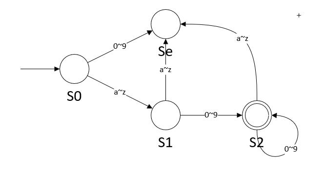
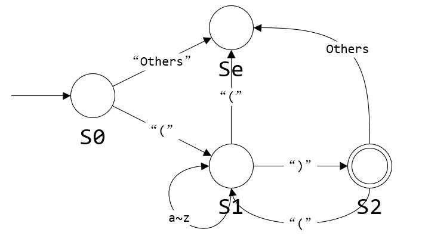
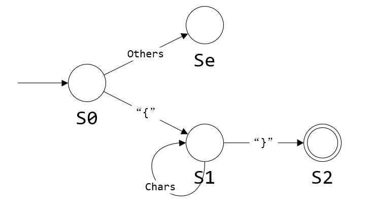
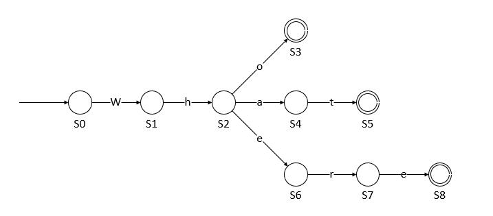
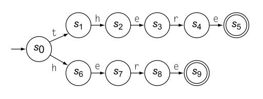

# Scanners

## 2.2 Recognizing Words

**Review Questions**<br>
Construct an FA to accept each of the following languages:<br>

1. A six-character identifier consisting of an alphabetic character followed by zero to five alphanumeric characters.<br>
   
2. A string of one or more oairs, where each pair consists of an open parenthesis followed by a close parenthsis.<br>
   
3. A Pascal comment, which consists of an open brace, {, followed by zero or more characters drawn from an alphabet, **Sigma**,  followed by a close brace, }.
   

## 2.3 Regular Expressions

**Review Questions**<br>

1. Recall the RE for six-character identifier, written using a finite closure.
   **([A...Z]\|[a...z])([A..Z]\|[a..z]\|[0...9])^5**

   rewrite it in terms of the three basic RE operations: Alternation, concatenation, and closure.
   ([A...Z]\|[a...z])([A..Z]\|[a..z]\|[0...9])([A..Z]\|[a..z]\|[0...9])([A..Z]\|[a..z]\|[0...9])([A..Z]\|[a..z]\|[0...9])([A..Z]\|[a..z]\|[0...9])

2. In PL/I, the programmer can insert a quotation mark into a string by writing two quotation marks in a row. Thus, the string

   _The quotation mark, ", should be tyoeset in italics_
   would be  weitten in a PL/I program as 
   _"The quotation mark, "", should be tyoeset in italics"_
   Design a _RE_ ad a _FA_ to recognize PL/I strings. Assume that strings begin and end with quotation marks and contain only symbols drawn from an alphabet, sesignated as **Sigma**. Quotation marks are the only special case.
   **Answer:**

```python
RE"(^"|"")*"
```

## 2.4 Recognizing Words

**Review Questions**

1. Consider the RE _who|what|where_. Use Thompon’s construction to build an NFA from RE. Use the subset construction to build a DFA from the NFA. Minimize the DFA.<br>
   
2. Minimize the following DFA:<br>
   

| Step | Current Partition                    | Set               | Char  | Action       |
| ---- | ------------------------------------ | ----------------- | ----- | ------------ |
| 0    | {5,9}, {0,1,2,3,4,6,7,8}             | ----              | ----  | ----         |
| 1    | {5,9}, {0,1,2,3,4,6,7,8}             | {5,9}             | _all_ | _none_       |
| 2    | {5,9}, {0,1,2,3,4,6,7,8}             | {0,1,2,3,4,6,7,8} | _t_   | _split_{0}   |
| 3    | {5,9}, {0}, {1,2,3,4,6,7,8}          | {1,2,3,4,6,7,8}   | _h_   | _split_{1}   |
| 4    | {5,9}, {0}, {1}, {2,3,4,6,7,8}       | {2,3,4,6,7,8}     | _e_   | _split_{2,6} |
| 5    | {5,9}, {0}, {1}, {2,6}, {3,4,7,8}    | {3,4,7,8}         | _r_   | _split_{3,7} |
| 6    | {5,9}, {0}, {1}, {2,6}, {3,7}, {4,8} | _all_             | _all_ | _none_       |

## 2.5 Implementing Scanners

**Review Questions**

1. Given the DFA shown to the left, complete the following:
   **a.** Sketch the character classifier that you would use in a table-driven implementation of this DFA.
   **b.** Build the transition table, based on the transition diagram and your character classifier.
   **c.** Write an eequivalent direct-coded scanner.
   **Answer:**
   **Char Cat**

| a   | b   |   c |   EOF | Other |
| --- | --- | -- | ----|--- |
| a   | b   |   c | Other | Other |

**Transition table**
| | a   | b   |   c | Other |
|--| --- | --- | --| ---- |
| S0 | S1 | S2 | S3 | Se |
| S1 | Se | S4 | Se | Se |
| S2 | Se | Se | S5 | Se |
|S3|S6|Se|Se|Se|
|S4|Se|S7|Se|Se|
|S5|S8|Se|Se|Se|
|S6|Se|S9|Se|Se|
|S7|Se|Se|Se|Se|
|S8|Se|Se|Se|Se|
|S9|Se|Se|Se|Se|
|Se|Se|Se|Se|Se|
